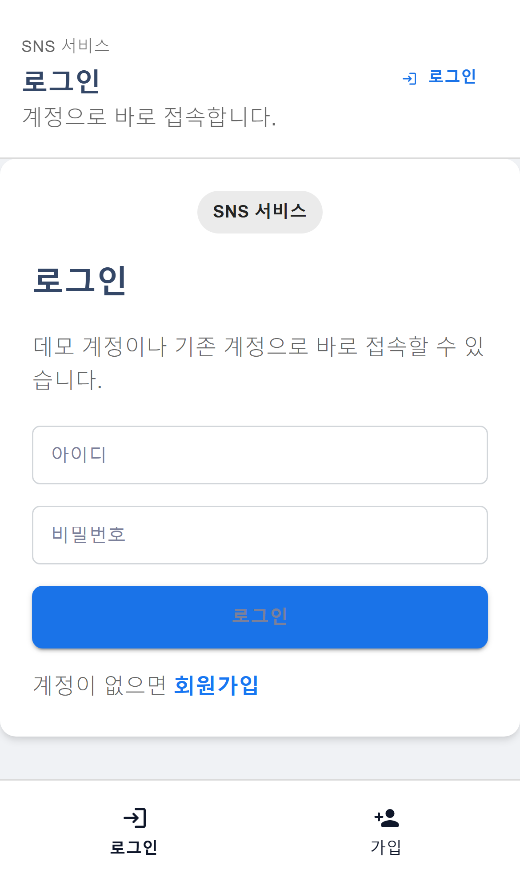
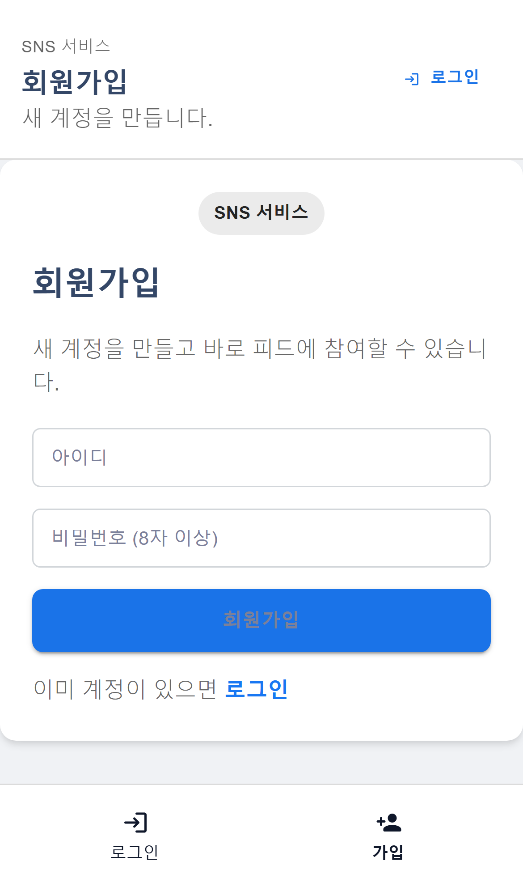
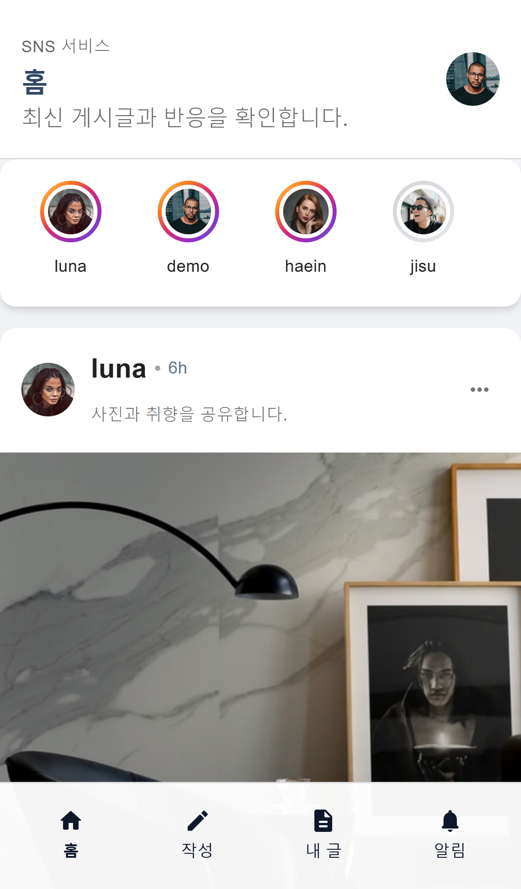
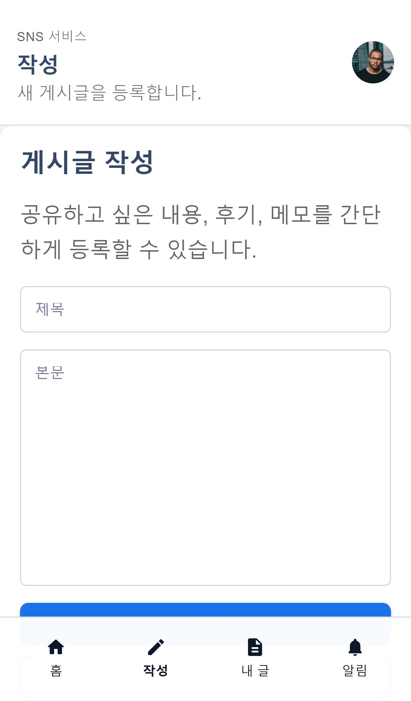
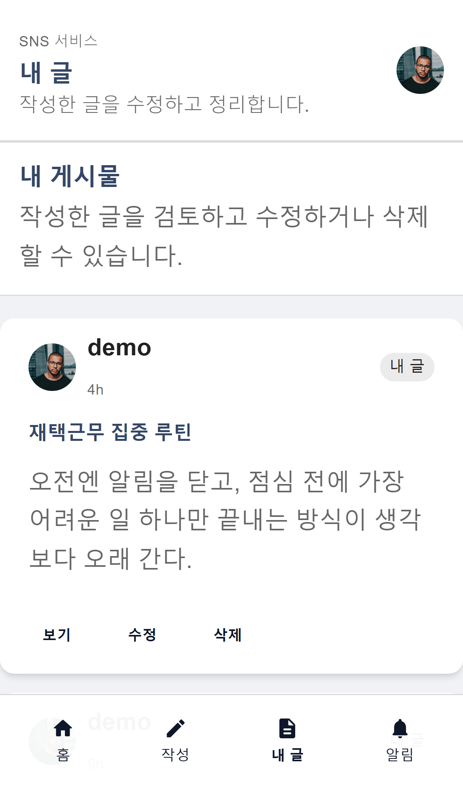
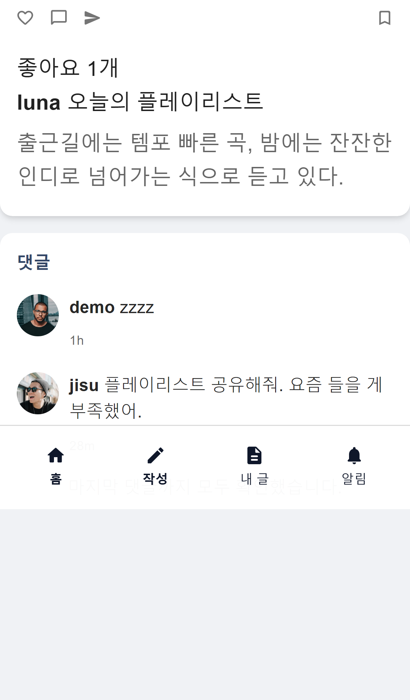
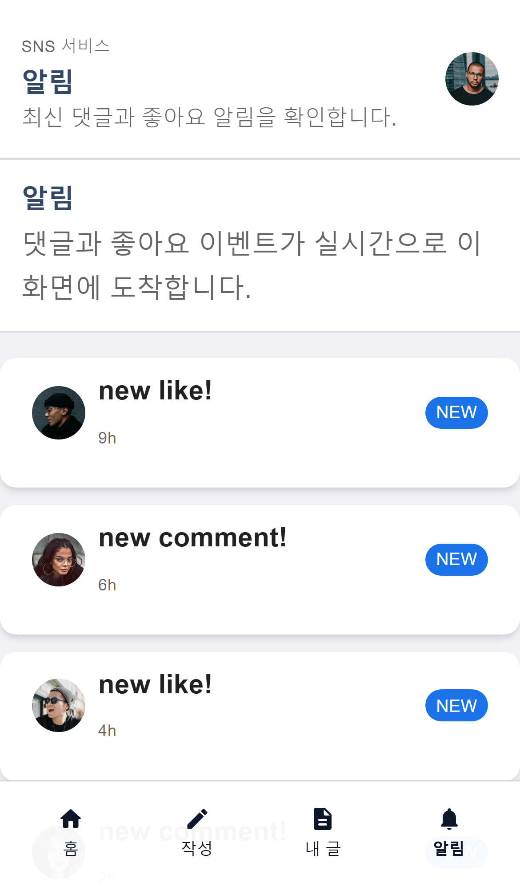

# SNS Service

`SNS Service`는 게시글 기반 소셜 피드, 댓글, 좋아요, 알림, 신고 처리까지 포함한 풀스택 SNS 프로젝트입니다. 백엔드는 Spring Boot로 인증/도메인/API를 담당하고, 프론트엔드는 React로 피드 경험을 제공합니다.

포트폴리오 관점에서 이 프로젝트의 프론트 UI는 **Instagram 웹/모바일 피드 구조를 참고한 클론형 인터페이스**로 정리했습니다. 브랜드 요소를 그대로 재사용한 것이 아니라, 피드 카드, 스토리, 하단 탭, 단일 컬럼 소비 흐름 같은 UI 패턴을 참고해 구현했습니다.

## 프로젝트 설명

- JWT 기반 회원가입/로그인
- 게시글 작성, 수정, 삭제, 목록 조회, 내 글 조회
- 댓글 작성 및 조회
- 좋아요 처리 및 좋아요 수 조회
- SSE(Server-Sent Events) 기반 알림 구독
- 신고 누적 기반 자동 블라인드
- 관리자 신고 처리 및 집계 API
- 무한 스크롤 기반 피드/알림/댓글 로딩
- 로컬 실행용 데모 데이터 자동 시드

이 저장소는 백엔드와 프론트엔드를 함께 포함한 통합 레포지토리입니다.  
즉, 단순한 CRUD 샘플이 아니라 **인증, 실시간 이벤트, 콘텐츠 관리, 프론트 UI 흐름**까지 한 번에 보여주는 형태로 정리했습니다.

## 화면 미리보기

모든 이미지는 모바일 기준 캡처입니다.

<table>
  <tr>
    <td align="center" width="50%"><strong>로그인</strong></td>
    <td align="center" width="50%"><strong>회원가입</strong></td>
  </tr>
  <tr>
    <td></td>
    <td></td>
  </tr>
  <tr>
    <td align="center"><strong>피드</strong></td>
    <td align="center"><strong>게시글 작성</strong></td>
  </tr>
  <tr>
    <td></td>
    <td></td>
  </tr>
  <tr>
    <td align="center"><strong>내 게시물</strong></td>
    <td align="center"><strong>게시글 상세</strong></td>
  </tr>
  <tr>
    <td></td>
    <td></td>
  </tr>
  <tr>
    <td align="center"><strong>알림</strong></td>
    <td></td>
  </tr>
  <tr>
    <td></td>
    <td></td>
  </tr>
</table>

## 주요 기능

### 사용자 기능

- 회원가입 / 로그인
- 게시글 작성 / 수정 / 삭제
- 피드 조회
- 내 게시물 조회
- 게시글 좋아요
- 댓글 작성 / 조회
- 실시간 알림 수신

### 운영/관리 기능

- 게시글 신고 등록
- 신고 누적 임계치 기반 자동 블라인드
- 관리자 신고 승인 / 반려
- 관리자 신고 검색 (`status`, `reasonType`, `postId`, `reporterUsername`)
- 관리자 신고 대시보드 집계

### 프론트 UI 특징

- Instagram 피드 패턴을 참고한 카드형 피드
- 스토리 바 + 하단 탭 네비게이션
- PC/모바일 동일 단일 컬럼 레이아웃
- 페이지네이션 제거 후 무한 스크롤 적용

## 기술 스택


- Java 17
- Spring Boot 2.7.x
- Spring Security + JWT
- Spring Data JPA
- MariaDB
- Redis
- SSE (Server-Sent Events)
- React (CRA)
- Gradle

## 프로젝트 구조

```text
sns_service/
├── src/main/java/dev/be/snsservice/
│   ├── configuration/           # Security, Redis, JWT, Local seed
│   ├── controller/              # User/Post/Report API
│   │   ├── request/             # 요청 DTO
│   │   └── response/            # 응답 DTO
│   ├── exception/               # 예외/에러코드/전역 핸들러
│   ├── model/                   # 도메인 모델, enum
│   │   └── entity/              # JPA Entity
│   ├── repository/              # JPA/캐시/SSE Repository
│   ├── service/                 # 비즈니스 로직
│   └── util/                    # JWT/유틸
├── src/main/resources/
│   └── application.yml
├── front-end/                   # React 프론트엔드
│   ├── src/layouts/             # 피드/인증/알림/게시글 화면
│   ├── src/hooks/               # 무한 스크롤 훅
│   ├── src/utils/               # 프로필/이미지 메타, 병합 유틸
│   └── screenshots/mobile/      # README용 모바일 화면 캡처
├── database/                    # DB 도커 설정
├── redis/                       # Redis 도커 설정
└── docker-compose-local.yml
```

## 실행 방법

### 1. 백엔드 실행

```powershell
.\gradlew.bat build
.\gradlew.bat bootRun
```

로컬 프로필 예시:

```powershell
$env:SPRING_DATASOURCE_URL="jdbc:mariadb://localhost:33306/sns"
$env:SPRING_DATASOURCE_USERNAME="root"
$env:SPRING_DATASOURCE_PASSWORD="1234"
$env:SPRING_PROFILES_ACTIVE="local"
.\gradlew.bat bootRun -x npmBuild -x npmInstall -x copyFrontEnd
```

### 2. 프론트엔드 실행

```powershell
cd front-end
npm install
npm run start
```

### 3. 로컬 인프라 실행

```powershell
docker compose -f docker-compose-local.yml up -d
```

## 데모 계정

로컬 `local` 프로필에서는 데모 데이터가 자동으로 들어갑니다.

- 일반 사용자: `demo / password123!`
- 관리자 사용자: `admin / admin1234!`

자동 생성되는 데이터:

- 사용자 6명
- 게시글 12개
- 댓글 8개
- 좋아요 20개
- 알림 6개
- 신고 3개

## 이번 정리에서 보완한 부분

### 백엔드

- 로컬 프로필에서 Redis 미연결 시 인메모리 캐시 fallback 적용
- 로컬 데모 데이터 자동 시드 추가
- MariaDB 호환성을 위해 JSON 컬럼을 `TEXT` 기반으로 보정
- JWT/SSE 구독 처리 안정성 보강
- 요청 검증과 전역 예외 응답 구조 정리

### 프론트엔드

- 사용자명 매핑 오류 수정
- PC/모바일 동일 단일 컬럼 레이아웃으로 재정리
- Instagram 피드 패턴 기반 UI 개선
- 페이지네이션 제거 후 무한 스크롤 적용
- 로그인/회원가입 비동기 처리 경고 정리

## 관련 저장소

- 원격 저장소: `https://github.com/xowlsakffl/sns_service.git`
- 프론트는 이 저장소의 `front-end` 디렉터리에 포함되어 있습니다.
